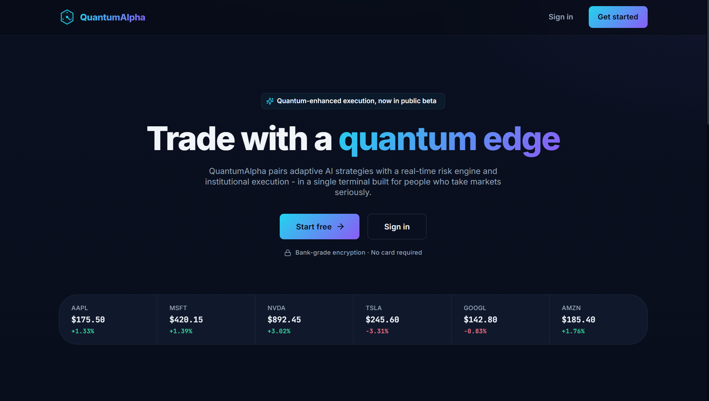

# QuantumAlpha


## AI-Driven Quantitative Trading Platform

QuantumAlpha is a quantitative trading platform built as a set of Flask services: an API gateway, a data service, an AI engine, a risk service, and an execution service, each independently deployable behind a shared Docker image. It's paired with a React web dashboard and a React Native mobile app. The AI engine trains and serves LSTM, CNN, Transformer-style, and reinforcement-learning models directly through its own API, rather than sitting as a disconnected library.

<div align="center">
  
</div>

## Table of Contents

- [Overview](#overview)
- [Project Structure](#project-structure)
- [Feature Status](#feature-status)
- [Technology Stack](#technology-stack)
- [Architecture](#architecture)
- [Installation and Setup](#installation-and-setup)
- [Running the Stack](#running-the-stack)
- [API Surface](#api-surface)
- [Testing](#testing)
- [CI/CD Pipeline](#cicd-pipeline)
- [Documentation](#documentation)
- [Contributing](#contributing)
- [License](#license)

## Overview

QuantumAlpha demonstrates a quantitative trading workflow across a real, runnable set of services. The data, AI engine, risk, and execution services are each standalone Flask apps that can run as separate containers, while portfolio management and the trading engine run in-process inside the API gateway rather than as their own services. The AI engine's model lifecycle (create, train, predict, evaluate) is genuinely implemented for LSTM, CNN, and Transformer-style networks (TensorFlow/Keras) and for reinforcement-learning agents (PPO, DQN, A2C, SAC via Stable-Baselines3).

## Project Structure

```
QuantumAlpha/
├── code/
│   ├── backend/
│   │   ├── api/                  # API gateway (Flask): auth, portfolio, trading,
│   │   │                         # admin, system endpoints
│   │   ├── data_service/         # Standalone service: market and alternative data
│   │   ├── execution_service/    # Standalone service: orders, broker adapter
│   │   ├── risk_service/         # Standalone service: VaR, stress testing, position sizing
│   │   ├── portfolio_service/    # In-process module (imported by the API gateway)
│   │   ├── trading_engine/       # In-process module (imported by the API gateway)
│   │   ├── analytics_service/    # Performance attribution, factor analysis
│   │   ├── compliance_service/   # Compliance monitoring, regulatory reporting
│   │   ├── common/               # Shared auth, database, messaging, monitoring
│   │   └── tests/                # Backend test suite (pytest)
│   ├── ai_models/
│   │   ├── engine/               # Standalone service: model_manager, prediction_service,
│   │   │                         # reinforcement_learning
│   │   └── tests/                # AI engine test suite (pytest)
│   └── Dockerfile.service        # Shared image; APP_MODULE build arg selects the service
├── web-frontend/                 # React (Vite) dashboard
├── mobile-frontend/              # React Native app
├── infrastructure/               # Docker, Kubernetes, Terraform, monitoring
├── scripts/                      # Setup, run, test, and deploy scripts
├── docs/                         # Documentation (this directory)
└── README.md
```

## Feature Status

### Application tier (wired and tested)

| Component                    | Details                                                                                                                                                                                                                                                        |
| :--------------------------- | :------------------------------------------------------------------------------------------------------------------------------------------------------------------------------------------------------------------------------------------------------------- |
| **API gateway**              | Flask app exposing `/api/auth`, `/api/portfolio`, `/api/trade`, `/api/admin`, and `/api/system` routes, plus `/health`. Portfolio management and the trading engine run in-process here rather than as separate services.                                      |
| **Data service**             | Standalone Flask app for market data and alternative data, backed by PostgreSQL, InfluxDB (time series), MongoDB (alternative data), and Redis.                                                                                                                |
| **AI engine**                | Standalone Flask app with a real model lifecycle: create, train, predict, evaluate, and delete for LSTM, CNN, and Transformer-style networks (TensorFlow/Keras), plus reinforcement-learning agents (PPO, DQN, A2C, SAC via Stable-Baselines3).                |
| **Risk service**             | Standalone Flask app for Value at Risk, stress testing, position sizing, and an online-learning risk updater.                                                                                                                                                  |
| **Execution service**        | Standalone Flask app for order management, execution strategies, and a broker adapter. The adapter is a generic HTTP client against a configurable `broker.url`; Alpaca API key fields exist in configuration, but there's no Alpaca-specific SDK integration. |
| **Messaging**                | Kafka producer and consumer classes (via `confluent-kafka`) in the shared `common` module, now added to `requirements.txt`. `alpaca-trade-api` and `pika` are also listed there but aren't imported anywhere in the codebase.                                  |
| **Auth**                     | JWT sessions via Flask-JWT-Extended, with MFA-related fields on the user model. The signing key falls back to a placeholder default if `SECRET_KEY` is unset, with no check that rejects the placeholder in production.                                        |
| **Compliance and analytics** | Standalone modules for compliance monitoring, regulatory reporting, performance attribution, and factor analysis, imported by the API gateway.                                                                                                                 |
| **Web dashboard**            | React app (JavaScript) with Redux Toolkit for state, Material-UI for components, and Recharts for charts.                                                                                                                                                      |
| **Mobile app**               | React Native app (a mix of TypeScript and JavaScript) with React Navigation, Zustand for state, and `react-native-chart-kit` for charts.                                                                                                                       |

## Technology Stack

| Area             | Technology                                                                                                     |
| :--------------- | :------------------------------------------------------------------------------------------------------------- |
| Backend services | Python 3.11, Flask, Gunicorn                                                                                   |
| Auth             | Flask-JWT-Extended, MFA-related user model fields                                                              |
| Data layer       | PostgreSQL, MongoDB, InfluxDB, Redis                                                                           |
| Messaging        | Kafka (confluent-kafka)                                                                                        |
| ML / RL          | TensorFlow/Keras (LSTM, CNN, Transformer-style networks), Stable-Baselines3 (PPO, DQN, A2C, SAC), scikit-learn |
| Web frontend     | React 18, Redux Toolkit, Material-UI, Recharts, Vite                                                           |
| Mobile frontend  | React Native, TypeScript and JavaScript, React Navigation, Zustand, react-native-chart-kit                     |
| Infrastructure   | Docker, Docker Compose, Kubernetes, Terraform                                                                  |
| Monitoring       | Prometheus, Grafana, Elasticsearch, Kibana                                                                     |
| CI/CD            | GitHub Actions                                                                                                 |
| Testing          | pytest (backend and AI engine), Jest (web and mobile)                                                          |

## Architecture

```
Clients
  ├── web-frontend (React)               ── HTTP/JSON ──┐
  └── mobile-frontend (React Native)     ── HTTP/JSON ──┤
                                                        ▼
API Gateway (Flask)
  /api/auth · /api/portfolio · /api/trade · /api/admin · /api/system
  Runs the portfolio_service and trading_engine modules in-process.

Standalone services (each a separate Flask app, same shared Docker image)
  data-service     market data, alternative data, feature engineering
  ai-engine        model lifecycle (LSTM, CNN, Transformer, RL agents)
  risk-service     VaR, stress testing, position sizing, online learning
  execution-service order management, execution strategies, broker adapter

Data layer
  PostgreSQL · MongoDB · InfluxDB · Redis · Kafka
```

See [docs/ARCHITECTURE.md](docs/ARCHITECTURE.md) for detail.

## Installation and Setup

Prerequisites: Python 3.11+, Node.js 18+, and Docker (for the full multi-service stack).

```bash
git clone https://github.com/quantsingularity/QuantumAlpha.git
cd QuantumAlpha

# Backend (installs dependencies shared by all Flask services)
cd code/backend
python -m venv .venv && source .venv/bin/activate
pip install -r requirements.txt

# Web frontend
cd ../../web-frontend
npm install

# Mobile frontend
cd ../mobile-frontend
npm install
```

For an automated setup:

```bash
git clone https://github.com/quantsingularity/QuantumAlpha.git
cd QuantumAlpha
./scripts/setup_env.sh
docker-compose -f infrastructure/docker-compose.yml up
```

Full, environment-specific instructions are in [docs/INSTALLATION.md](docs/INSTALLATION.md).

## Running the Stack

```bash
# Full stack, including Postgres, MongoDB, InfluxDB, Redis, Kafka, and every service
docker-compose -f infrastructure/docker-compose.yml up

# Or, run an individual Flask service directly (from code/, venv active)
APP_MODULE=backend.data_service.app:app python -m flask run --port 8081
APP_MODULE=backend.risk_service.app:app python -m flask run --port 8083
APP_MODULE=backend.execution_service.app:app python -m flask run --port 8084
APP_MODULE=ai_models.engine.app:app python -m flask run --port 8082

# API gateway (from code/backend, venv active)
python -m api.main                 # serves http://0.0.0.0:8080

# Web dashboard (from web-frontend)
npm run dev

# Mobile app (from mobile-frontend)
npm start
```

See [docs/USAGE.md](docs/USAGE.md) and [docs/CONFIGURATION.md](docs/CONFIGURATION.md).

## API Surface

Each service exposes its own `/health` check.

| Service           | Highlights                                                                                                                                                              |
| :---------------- | :---------------------------------------------------------------------------------------------------------------------------------------------------------------------- |
| API gateway       | `/api/auth/{register,login,logout,me}`, `/api/portfolio`, `/api/portfolio/positions`, `/api/trade/order`, `/api/trade/orders`, `/api/admin/users`, `/api/system/status` |
| Data service      | `/api/market-data/{symbol}`, `/api/alternative-data/{source}`, `/api/features/{symbol}`, `/api/data-sources`                                                            |
| AI engine         | `/api/models`, `/api/models/{id}`, `/api/train-model`, `/api/predict`, `/api/generate-signals`, `/api/rl/train`, `/api/rl/act`                                          |
| Risk service      | `/api/risk-metrics`, `/api/stress-test`, `/api/calculate-position`, `/api/portfolio-risk`, `/api/risk-alerts`                                                           |
| Execution service | `/api/orders`, `/api/orders/{id}/cancel`, `/api/execution-strategies`, `/api/brokers`, `/api/brokers/{id}/accounts`                                                     |

Full request and response shapes are in [docs/API.md](docs/API.md).

## Testing

```bash
# Backend (from code/backend)
pytest

# AI engine (from code/ai_models)
pytest

# Web (from web-frontend)
npm test

# Mobile (from mobile-frontend)
npm test
```

The mobile app also has an `e2e/` directory for end-to-end tests. The backend suite covers 7 test files across the services; the AI engine suite covers 3.

## CI/CD Pipeline

GitHub Actions (`.github/workflows/cicd.yml`) runs three jobs on push, pull request, and manual dispatch:

| Job                 | Depends on          | What it does                                                                       |
| :------------------ | :------------------ | :--------------------------------------------------------------------------------- |
| Code Quality Checks | -                   | Python formatter checks (autoflake, black) and a repository-wide Prettier check    |
| Backend Tests       | Code Quality Checks | Runs the pytest suite with coverage and uploads the coverage report as an artifact |
| Frontend Build      | Code Quality Checks | Installs dependencies and produces the production web build (no test step)         |

There is currently no CI job for the AI engine or the mobile app, even though both have their own test suites.

## Documentation

| Document                                                     | Contents                               |
| :----------------------------------------------------------- | :------------------------------------- |
| [docs/README.md](docs/README.md)                             | Documentation index                    |
| [docs/ARCHITECTURE.md](docs/ARCHITECTURE.md)                 | System architecture                    |
| [docs/API.md](docs/API.md)                                   | REST API reference                     |
| [docs/INSTALLATION.md](docs/INSTALLATION.md)                 | Setup for all components               |
| [docs/CONFIGURATION.md](docs/CONFIGURATION.md)               | Environment variables and config       |
| [docs/USAGE.md](docs/USAGE.md)                               | Running and using the platform         |
| [docs/CLI.md](docs/CLI.md)                                   | Helper scripts reference               |
| [docs/FEATURE_MATRIX.md](docs/FEATURE_MATRIX.md)             | Feature status, implemented vs planned |
| [docs/ML_MODEL_PERFORMANCE.md](docs/ML_MODEL_PERFORMANCE.md) | Model evaluation methodology           |
| [docs/TROUBLESHOOTING.md](docs/TROUBLESHOOTING.md)           | Common issues and fixes                |
| [docs/CONTRIBUTING.md](docs/CONTRIBUTING.md)                 | Contribution guide                     |
| [docs/examples/](docs/examples/)                             | Worked examples                        |

## Contributing

See [docs/CONTRIBUTING.md](docs/CONTRIBUTING.md).

## License

This project is licensed under the MIT License - see the [LICENSE](LICENSE) file for details.
